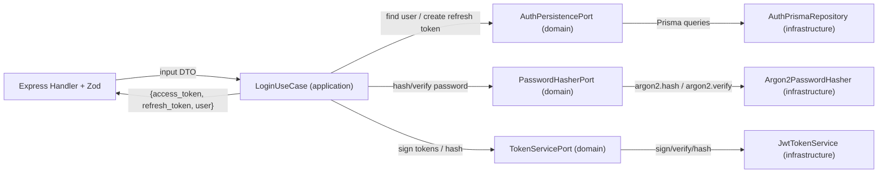

# Arquitectura Hexagonal (por capas) - `auth`

Este documento explica cómo refactorizar el módulo `auth` para separar responsabilidades siguiendo una arquitectura **hexagonal** con **capas**:

- `domain`: reglas puras + **puertos** (interfaces).
- `application`: **use cases** (casos de uso) que orquestan el flujo.
- `infrastructure`: adaptadores (Prisma, argon2, JWT).
- `infrastructure/http`: adaptador HTTP (Express + Zod) que traduce `req/res` a DTOs.

> En esta fase, solo `auth` fue refactorizado. Los demás módulos siguen como estaban.

---

## Diagnóstico del estado anterior

En `src/modules/auth/infrastructure/http/auth.routes.ts` el router hacía “todo junto”:

1. Validación (Zod)
2. Reglas/decisiones (errores `ApiError`)
3. Persistencia (Prisma: `prisma.usuario`, `prisma.cliente`, `prisma.refreshToken`)
4. Seguridad (argon2 para password, JWT para access/refresh)

Esto acopla la lógica de negocio a Express y a Prisma, y hace más difícil probar/razonar los flujos.

---

## Flujo objetivo (hexagonal)

### Flujo de login (conceptual)

---

## Mapa de responsabilidades (después del refactor)

### HTTP adapter

- Archivo: `src/modules/auth/infrastructure/http/auth.routes.ts`
- Mantiene:
  - Paths y endpoints (`/login`, `/register-cliente`, `/refresh`, `/me`, `/logout`)
  - Validación con Zod
  - Manejo de errores vía `next(error)` para que el `errorHandler` global se aplique igual
- Ahora delega a `use cases`:
  - `loginUseCase.execute(...)`
  - `registerClienteUseCase.execute(...)`
  - `refreshUseCase.execute(...)`
  - `logoutUseCase.execute(...)`

### Domain (puertos)

- `src/modules/auth/domain/ports/auth-persistence.port.ts`
  - Define `AuthPersistencePort` y tipos de dominio (`AuthUserPayload`, etc.)
- `src/modules/auth/domain/ports/password-hasher.port.ts`
  - Define la abstracción `PasswordHasherPort`
- `src/modules/auth/domain/ports/token-service.port.ts`
  - Define la abstracción `TokenServicePort`

Estas interfaces **no dependen** de Express ni Prisma.

### Application (use cases)

- `src/modules/auth/application/use-cases/login.use-case.ts`
- `src/modules/auth/application/use-cases/register-cliente.use-case.ts`
- `src/modules/auth/application/use-cases/refresh.use-case.ts`
- `src/modules/auth/application/use-cases/logout.use-case.ts`

Los use cases:
- replican la lógica actual del router,
- lanzan los mismos errores `ApiError` con los mismos `status`, `code` y mensajes,
- coordinan operaciones vía puertos (persistence/password/token).

### Infrastructure (adaptadores)

- Persistencia Prisma:
  - `src/modules/auth/infrastructure/persistence/auth-prisma.repository.ts`
  - Implementa `AuthPersistencePort`
  - Encapsula la rotación de refresh tokens con transacción (`rotateRefreshToken`)
- Password hashing:
  - `src/modules/auth/infrastructure/security/argon2-password-hasher.ts`
  - Implementa `PasswordHasherPort` con `argon2`
- JWT:
  - `src/modules/auth/infrastructure/security/jwt-token.service.ts`
  - Implementa `TokenServicePort` como wrapper de `src/shared/security/jwt.ts`

---

## Contrato HTTP (compatibilidad)

Se preserva el contrato actual del módulo `auth`:

- `POST /auth/login`
  - responde `{ access_token, refresh_token, user }`
- `POST /auth/register-cliente`
  - responde status `201` con `{ user: { id, email, role, cliente_id } }`
- `POST /auth/refresh`
  - responde `{ access_token, refresh_token }`
- `GET /auth/me`
  - se mantiene igual (usa `requireAuth` y retorna `req.user`)
- `POST /auth/logout`
  - responde status `204`

Además, los mensajes/códigos de error producidos por los use cases deben coincidir con los del router anterior:

- `Credenciales invalidas`
- `El email no existe en clientes`
- `El usuario ya existe`
- `Refresh token revocado o invalido`

---

## Siguientes fases (sugerencia)

El siguiente paso natural sería aplicar el mismo patrón a `propiedades` (y en particular a `POST /propiedades/:id/historial`, donde hoy vive el cálculo + transacción).

Esto reduce el “blast radius” de cambios de negocio y mejora testabilidad.

