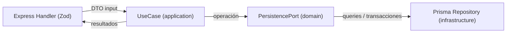

# Arquitectura Hexagonal (por capas) - `propiedades` + `gestiones`

Este documento explica el refactor de `propiedades` (incluye historial/saldo y gestiones dentro del router) y del módulo global `gestiones`, aplicando el mismo patrón de la fase anterior (`auth`).

En esta fase:
- `src/modules/propiedades/infrastructure/http/propiedades.routes.ts` pasa a ser un **adaptador HTTP fino**.
- Se crean **puertos (domain)**, **use cases (application)** y **repositorios Prisma (infrastructure)**.
- `src/modules/gestiones/infrastructure/http/gestiones.routes.ts` se refactoriza con port/use-case/repository.

---

## Diagnóstico del estado anterior

`src/modules/propiedades/infrastructure/http/propiedades.routes.ts` tenía la lógica mezclada en el router:
- `Zod` schemas + autorización
- validación de existencia/ownership (`404`/`403`)
- reglas de negocio (cálculo de `monto_a_la_fecha`)
- persistencia (`prisma.$transaction`) para `POST /propiedades/:id/historial`

Esto generaba acoplamiento fuerte del dominio al framework HTTP y dificultaba probar reglas sin Express.

---

## Flujo objetivo (hexagonal)

### Diagrama conceptual

### Caso crítico: `POST /propiedades/:id/historial`

El cálculo del saldo y la actualización de `propiedades.monto_a_la_fecha` siguen siendo **atómicos dentro de una transacción**:
- `saldoAnterior = Number(propiedad.monto_a_la_fecha)`
- `saldoNuevo = saldoAnterior + valor_cobrado - valor_pagado`
- crear `historial_pagos` con `monto_a_la_fecha = saldoNuevo`
- actualizar `propiedades.monto_a_la_fecha = saldoNuevo`

---

## Mapa de archivos (por capas)

### `propiedades`

1. **domain / puertos**
   - `src/modules/propiedades/domain/ports/propiedades-persistence.port.ts`
2. **application / use cases**
   - `src/modules/propiedades/application/use-cases/list-propiedades.use-case.ts`
   - `src/modules/propiedades/application/use-cases/get-propiedad.use-case.ts`
   - `src/modules/propiedades/application/use-cases/create-propiedad.use-case.ts`
   - `src/modules/propiedades/application/use-cases/update-propiedad.use-case.ts`
   - `src/modules/propiedades/application/use-cases/list-historial-pagos.use-case.ts`
   - `src/modules/propiedades/application/use-cases/create-historial-pago.use-case.ts`
   - `src/modules/propiedades/application/use-cases/list-gestiones.use-case.ts`
   - `src/modules/propiedades/application/use-cases/create-gestion.use-case.ts`
3. **infrastructure / adapters**
   - `src/modules/propiedades/infrastructure/persistence/propiedades-prisma.repository.ts`
4. **infrastructure/http / adapter HTTP**
   - `src/modules/propiedades/infrastructure/http/propiedades.routes.ts`

### `gestiones` (global)

1. **domain / puertos**
   - `src/modules/gestiones/domain/ports/gestiones-persistence.port.ts`
2. **application / use cases**
   - `src/modules/gestiones/application/use-cases/list-gestiones.use-case.ts`
3. **infrastructure / repositorio**
   - `src/modules/gestiones/infrastructure/persistence/gestiones-prisma.repository.ts`
4. **infrastructure/http**
   - `src/modules/gestiones/infrastructure/http/gestiones.routes.ts`

---

## Compatibilidad de contrato HTTP

Se preservaron:
- paths y métodos
- shapes principales de respuesta (se mantiene `{ items }` en endpoints que antes lo hacían)
- códigos/mensajes `ApiError` usados por el router anterior en `propiedades`:
  - `404` `code: "NOT_FOUND"`: `Propiedad no encontrada`
  - `403` `code: "FORBIDDEN"`: `Recurso fuera de alcance`

Endpoints cubiertos en `propiedades`:
- `GET /api/v1/propiedades`
- `GET /api/v1/propiedades/:id`
- `POST /api/v1/propiedades`
- `PATCH /api/v1/propiedades/:id`
- `GET /api/v1/propiedades/:id/historial`
- `POST /api/v1/propiedades/:id/historial`
- `GET /api/v1/propiedades/:id/gestiones`
- `POST /api/v1/propiedades/:id/gestiones`

Endpoint cubierto en `gestiones` (global):
- `GET /api/v1/gestiones` (admin)

---

## Riesgos principales (para validación)

1. `POST /propiedades/:id/historial`:
   - debe mantener exactamente el mismo cálculo y transacción atómica
2. Ownership (`cliente` vs `admin`):
   - para endpoints de lectura, `403 FORBIDDEN` debe dispararse igual que antes
3. Serialización de campos `Decimal`:
   - se retorna lo que proviene de Prisma; al convertir a JSON debe ser compatible con lo anterior

---

## Siguiente fase sugerida

Si quieres continuar, el siguiente “mejor retorno” suele ser:
- refactorizar `clientes` y/o `cuentas` a use cases/ports,
- y luego reutilizar patrones (wiring) para evitar instanciación en cada router HTTP.

